# python_interview_preparation
One great thing about interviews is that you get to know what you don't know, luckily I had a lot of interviews (and I know how it feel when you want a job but they ask you a question, you don't know the answer, and I you end up feeling like that is something you should of know)

## Theorical Questions Section

### Theorical Question 1

Do you understand why we put this line at the beggining of python files ?

#!/usr/local/bin/python

<b>Answer</b>

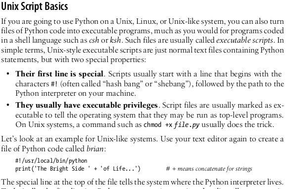

<b>Source</b>

learning python 5th edition - pag 59

### Theorical Question 2

Do you understand what the dir() function is for ?

<b>Answer</b>

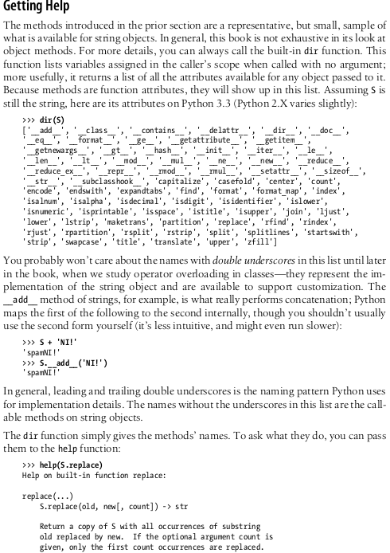

<b>Source</b>

learning python 5th edition - pag 104

### Theorical Question 3

Do you know what the pdb library is for ?

<b>Answer</b>

debugging

<b>Source</b>

here is the [link](https://docs.python.org/3/library/pdb.html).

### Theorical Question 4

Do you know what is ASCII text, how unicode help us represent it correctly and how to use unicode in python ?

<b>Answer</b>

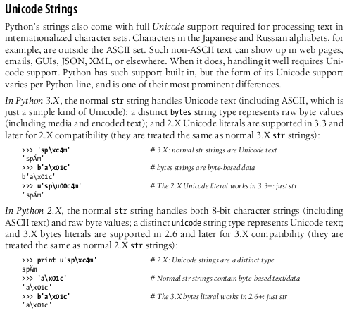

<b>Source</b>

learning python 5th edition - pag 106

### Theorical Question 5

Do you know how to use regular expressions in python ?

<b>Answer</b>

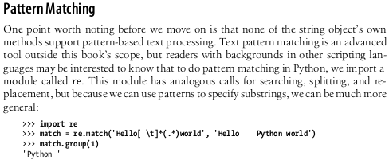

<b>Source</b>

learning python 5th edition - pag 106

### Theorical Question 6

Do you know what tuples are and when do we use them ?

<b>Answer</b>

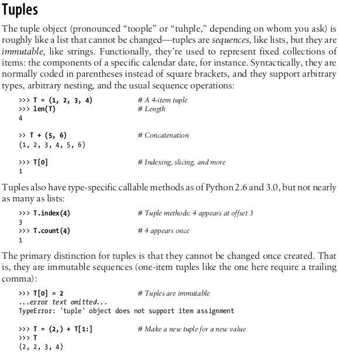

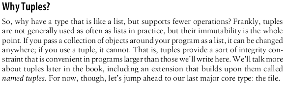

<b>Source</b>

learning python 5th edition - pag 106

### Theorical Question 7

Do you understand why we add the parameted "encoding utd_8" when we open a file ?

<b>Answer</b>

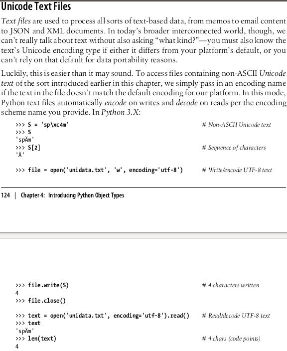

<b>Source</b>

learning python 5th edition - pag 106

### Theorical Question 8

Do you understand what __init__ and self mean ?

<b>Answer</b>

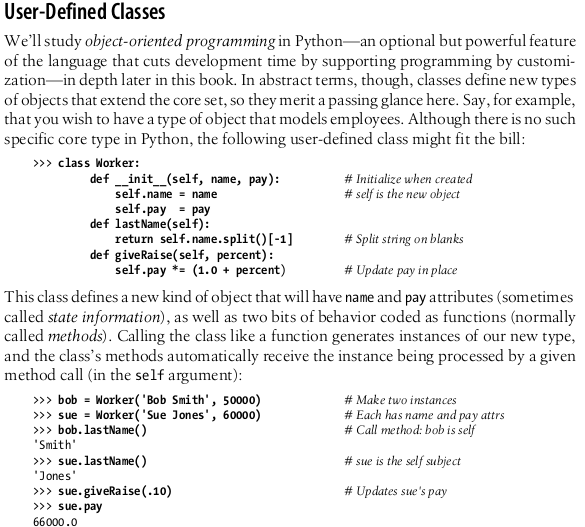

<b>Source</b>

learning python 5th edition - pag 106

### Theorical Question 9

Do you understand the difference between "==" and "is" ?

<b>Answer</b>

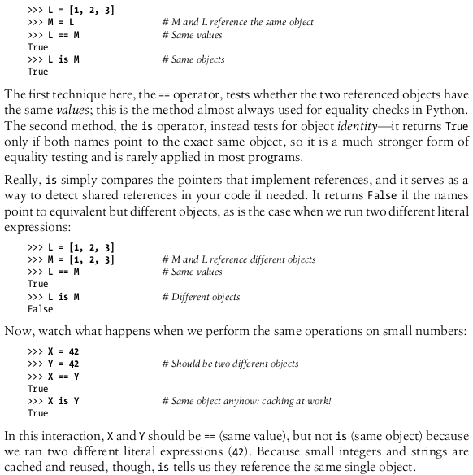

<b>Source</b>

learning python 5th edition - pag 186

### Theorical Question 10

Do you know what would happen if you don't close a python file?

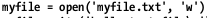

<b>Answer</b>

Calling the file close method terminates your connection to the external file, re-
leases its system resources, and flushes its buffered output to disk if any is still in
memory. As discussed in Chapter 6, in Python an object’s memory space is auto-
matically reclaimed as soon as the object is no longer referenced anywhere in the
program.

<b>Source</b>

learning python 5th edition - pag 290

### Theorical Question 11

Do you know what we use pickle for?

<b>Answer</b>

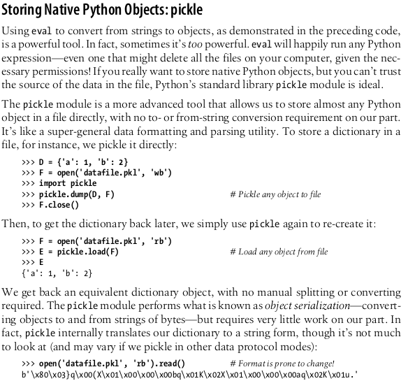

<b>Source</b>

learning python 5th edition - pag 290

### Theorical Question 12

Do you understand the difference between generators and functions?

<b>Answer</b>

return sends a result object back to the caller. When a function is called, the
caller stops until the function finishes its work and returns control to the caller.
Functions that compute a value send it back to the caller with a return statement;
the returned value becomes the result of the function call. A return without a value
simply returns to the caller (and sends back None , the default result).

yield sends a result object back to the caller, but remembers where it left
off. Special word "yield" create a generator. Functions known as generators may also use the yield statement to send back

<b>Source</b>

learning python 5th edition - pag 475

### Theorical Question 13

Do you know the argument matching syntax?

<b>Answer</b>

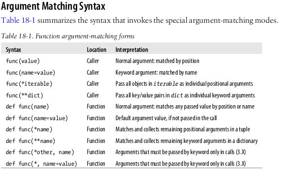

<b>Source</b>

learning python 5th edition - pag 530

### Theorical Question 14

When you are importing a module in python do you know where does it look for it ?

<b>Answer</b>

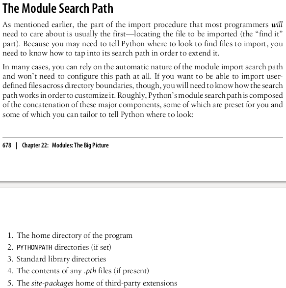

<b>Source</b>

learning python 5th edition - pag 638

### Theorical Question 15

Do you understand what these lines are for in a python program ?

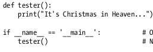

<b>Answer</b>

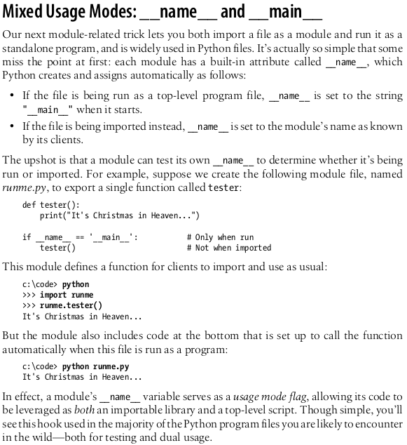

<b>Source</b>

learning python 5th edition - pag 638

