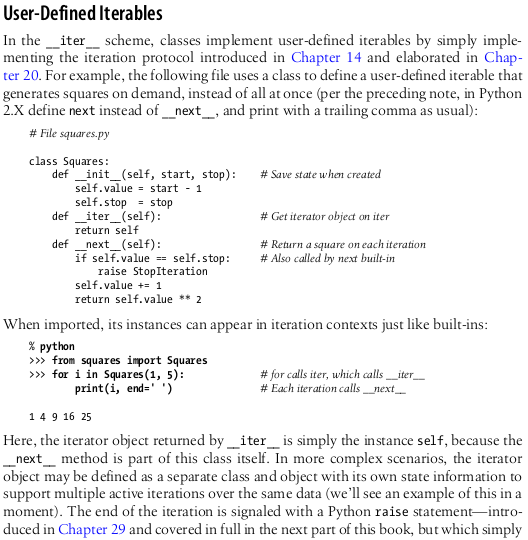
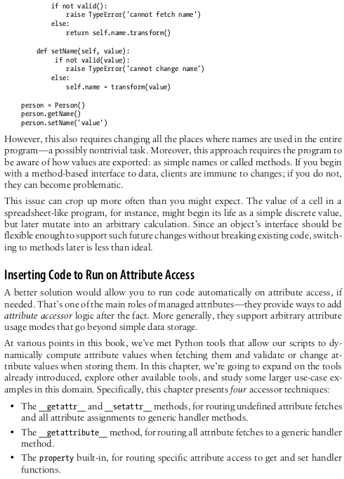
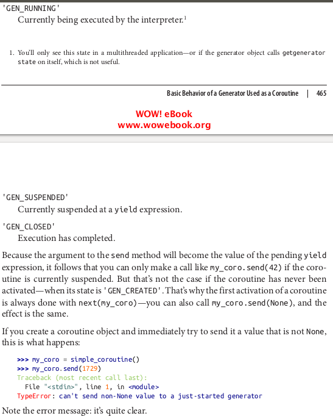
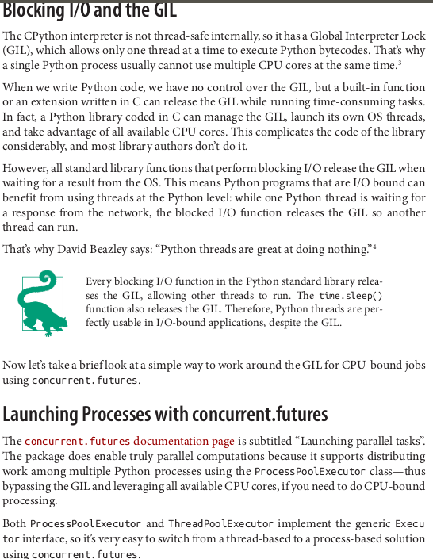
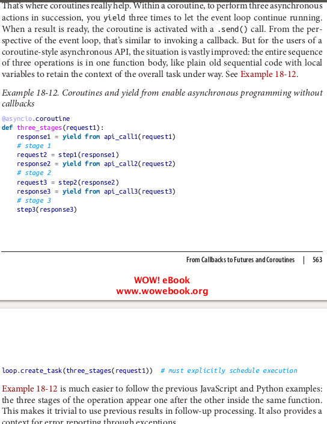
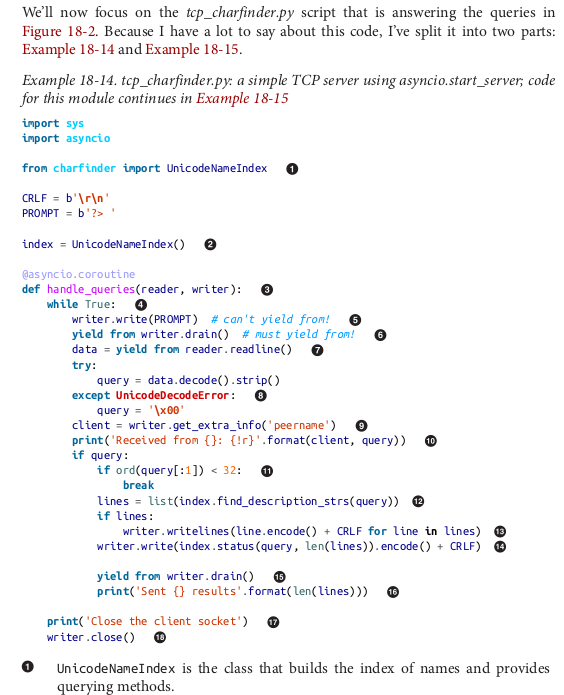

# python_interview_preparation
One great thing about interviews is that you get to know what you don't know, luckily I had a lot of interviews (and I know how it feel when you want a job but they ask you a question, you don't know the answer, and I you end up feeling like that is something you should of know)

## Theorical Questions Section

### Theorical Question 1

Do you understand why we put this line at the beggining of python files ?

#!/usr/local/bin/python

<b>Answer</b>

<b>Source</b>

learning python 5th edition - pag 59

### Theorical Question 2

Do you understand what the dir() function is for ?

<b>Answer</b>

<b>Source</b>

learning python 5th edition - pag 104

### Theorical Question 3

Do you know what the pdb library is for ?

<b>Answer</b>

debugging

<b>Source</b>

here is the [link](https://docs.python.org/3/library/pdb.html).

### Theorical Question 4

Do you know what is ASCII text, how unicode help us represent it correctly and how to use unicode in python ?

<b>Answer</b>

<b>Source</b>

learning python 5th edition - pag 106

### Theorical Question 5

Do you know how to use regular expressions in python ?

<b>Answer</b>

<b>Source</b>

learning python 5th edition - pag 106

### Theorical Question 6

Do you know what tuples are and when do we use them ?

<b>Answer</b>

<b>Source</b>

learning python 5th edition - pag 106

### Theorical Question 7

Do you understand why we add the parameted "encoding utd_8" when we open a file ?

<b>Answer</b>

<b>Source</b>

learning python 5th edition - pag 106

### Theorical Question 8

Do you understand what __init__ and self mean ?

<b>Answer</b>

<b>Source</b>

learning python 5th edition - pag 106

### Theorical Question 9

Do you understand the difference between "==" and "is" ?

<b>Answer</b>

<b>Source</b>

learning python 5th edition - pag 186

### Theorical Question 10

Do you know what would happen if you don't close a python file?

<b>Answer</b>

Calling the file close method terminates your connection to the external file, re-
leases its system resources, and flushes its buffered output to disk if any is still in
memory. As discussed in Chapter 6, in Python an object’s memory space is auto-
matically reclaimed as soon as the object is no longer referenced anywhere in the
program.

<b>Source</b>

learning python 5th edition - pag 290

### Theorical Question 11

Do you know what we use pickle for?

<b>Answer</b>

<b>Source</b>

learning python 5th edition - pag 290

### Theorical Question 12

Do you understand the difference between generators and functions?

<b>Answer</b>

return sends a result object back to the caller. When a function is called, the
caller stops until the function finishes its work and returns control to the caller.
Functions that compute a value send it back to the caller with a return statement;
the returned value becomes the result of the function call. A return without a value
simply returns to the caller (and sends back None , the default result).

yield sends a result object back to the caller, but remembers where it left
off. Special word "yield" create a generator. Functions known as generators may also use the yield statement to send back

<b>Source</b>

learning python 5th edition - pag 475

### Theorical Question 13

Do you know the argument matching syntax?

<b>Answer</b>

<b>Source</b>

learning python 5th edition - pag 530

### Theorical Question 14

When you are importing a module in python do you know where does it look for it ?

<b>Answer</b>

<b>Source</b>

learning python 5th edition - pag 638

### Theorical Question 15

Do you understand what these lines are for in a python program ?

<b>Answer</b>

<b>Source</b>

learning python 5th edition - pag 638

### Theorical Question 16

I imagine you know how to sum two numbers in python or how to organiza number or words in a python list, but do you know how to change the behaviour when you sum two objects in python or how to change the way how objects are sorted in a python list ?

<b>Answer</b>

you would need to change special method __add__ to change the way how two objects are added up, and to change the way how objects are sorted we need to change the special methods __lt__ and __gt__ 

<b>Source</b>

learning python 5th edition - pag 805

https://stackoverflow.com/questions/48313301/python-sort-has-higher-priority-for-lt-than-gt

### Theorical Question 17

Do you know what specal methods could you use to change objects behaviours ?

<b>Answer</b>

<b>Source</b>

learning python 5th edition - pag 805

https://stackoverflow.com/questions/48313301/python-sort-has-higher-priority-for-lt-than-gt

### Theorical Question 18

Do you understand what abstractMethod are for in python  ?

<b>Answer</b>

<b>Source</b>

learning python 5th edition - pag 870

### Theorical Question 19

Do you know what the special methods __iter__ and __next__ are for ?

<b>Answer</b>

<b>Source</b>

learning python 5th edition - pag 895

### Theorical Question 20

Do you know what the special method __call__ ?

<b>Answer</b>

<b>Source</b>

learning python 5th edition - pag 922

### Theorical Question 21

How do you create a private variable in python ?

<b>Answer</b>

<b>Source</b>

learning python 5th edition - pag 945

### Theorical Question 22

Do you understand what static and class methods are ?

<b>Answer</b>

<b>Source</b>

learning python 5th edition - pag 945

### Theorical Question 23

Do you understand what decorators are ?

<b>Answer</b>

<b>Source</b>

learning python 5th edition - pag 1035

### Theorical Question 24

Do you understand what exceptions are ?

<b>Answer</b>

<b>Source</b>

learning python 5th edition - pag 1081

### Theorical Question 25

Do you understand what managed attributes and properties are ?

<b>Answer</b>

<b>Source</b>

learning python 5th edition - pag 1081

### Theorical Question 26

Do you know what corutines are ?

<b>Answer</b>

<b>Source</b>

fluent python - pag 468

### Theorical Question 27

Do you know what futures are and what concurrency is ?

<b>Answer</b>

<b>Source</b>

fluent python - pag 505

### Theorical Question 28

Do you know what the GIL is ?

<b>Answer</b>

<b>Source</b>

fluent python - pag 505

### Theorical Question 29

Do you know what the asyncio python library is ?

<b>Answer</b>

<b>Source</b>

fluent python - pag 538

### Theorical Question 30

Do you know the difference between \__new__ and \__init__  ?

<b>Answer</b>

<b>Source</b>

https://santoshk.dev/posts/2022/__init__-vs-__new__-and-when-to-use-them/#:~:text=__new__%20returns%20a,returned%20by%20__new__%20.

